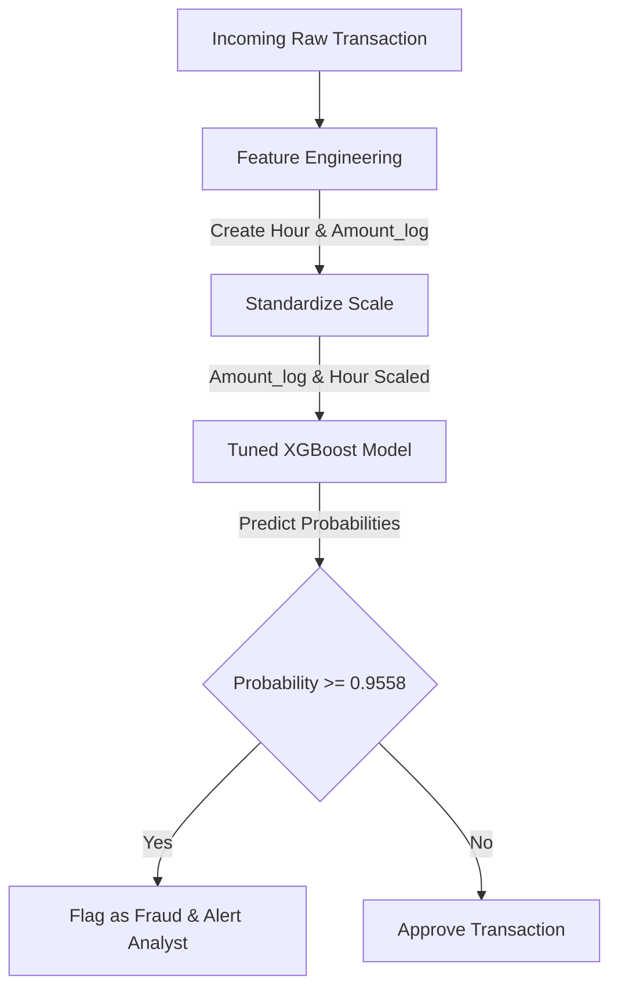

# Credit Card Fraud Detection using Supervised Learning

This repository contains a complete end-to-end Machine Learning project to detect fraudulent credit card transactions. Standard accuracy is a misleading metric for highly imbalanced datasets. This project details how to clean, balance, train, optimize, evaluate, and deploy a robust model that maximizes financial net benefit for Paytm's fraud detection team.

---

## 📊 Dataset Overview
The dataset contains transactions made by credit cards in September 2013 by European cardholders.
- **Dataset Source:** [Kaggle Credit Card Fraud Detection](https://www.kaggle.com/datasets/mlg-ulb/creditcardfraud)
- **Total Transactions:** 284,807
- **Fraud Transactions:** 492 (0.172%)
- **Legitimate Transactions:** 284,315 (99.828%)
- **Data File used:** `creditcard.xlsx`

> [!WARNING]
> Because the fraud class is extremely rare (0.172%), predicting all transactions as legitimate gives a **99.83% accuracy**, but fails to detect any fraud. Therefore, **Precision-Recall Area Under Curve (PR-AUC)**, **Recall**, and **F1-Score** are our primary evaluation metrics instead of accuracy.

---

## 🛠️ Project Structure & Notebook Breakdown
The project is organized in sequential notebooks:
* **[step 2.ipynb](file:///d:/ml%20project/froud%20detection%20model/step%202.ipynb): Dataset Loading & EDA**
  * Loads `creditcard.xlsx`.
  * Checks class distributions and profiles skewed features like `Amount` and `Time`.
* **[step 3.ipynb](file:///d:/ml%20project/froud%20detection%20model/step%203.ipynb): Data Preprocessing & Feature Engineering**
  * Applies log transformation: `Amount_log = log1p(Amount)`.
  * Extracts hour of the transaction: `Hour = (Time % 86400) // 3600`.
  * Standardizes engineered features using `StandardScaler`.
  * Splits dataset into 80% Train and 20% Test splits (Stratified).
  * Creates balanced training variants: Original, SMOTE oversampled (10%), and Random Undersampled (10%).
* **[step 4.ipynb](file:///d:/ml%20project/froud%20detection%20model/step%204.ipynb): Model Building — Logistic Regression & Random Forest**
  * Trains Logistic Regression on all 3 imbalance strategies.
  * Identifies SMOTE as the best balancing strategy.
  * Trains a Random Forest Classifier on SMOTE-balanced data with balanced class weights.
* **[step 5.ipynb](file:///d:/ml%20project/froud%20detection%20model/step%205.ipynb): Model Building — XGBoost with Full Tuning**
  * Trains a baseline XGBoost model with `scale_pos_weight` set to the training class imbalance ratio.
  * Computes feature importances and prints Precision-Recall curves.
* **[step 6.ipynb](file:///d:/ml%20project/froud%20detection%20model/step%206.ipynb): Model Evaluation, Threshold Tuning & Comparison**
  * Conducts hyperparameter tuning of XGBoost using `RandomizedSearchCV` to optimize `average_precision`.
  * Runs Threshold Tuning to find the F1-optimal and Recall-constrained (Recall $\ge$ 90%) thresholds.
* **[step 7.ipynb](file:///d:/ml%20project/froud%20detection%20model/step%207.ipynb): Business Simulation & Cost-Benefit Analysis**
  * Assigns costs: Fraud transaction average loss of ₹4,500; Analyst manual review cost of ₹150.
  * Simulates the net financial benefit across the test set (56,962 transactions).
* **[step 8.ipynb](file:///d:/ml%20project/froud%20detection%20model/step%208.ipynb): Pipeline, Deployment & GitHub Submission**
  * Bundles `StandardScaler` and tuned `XGBClassifier` into an sklearn `Pipeline`.
  * Dumps the final model to `fraud_detection_model.pkl`.
  * Tests the final loaded model on sample data.

---

## 📈 Model Performance Summary (on Test Set)

| Model Configuration | Imbalance Strategy | Decision Threshold | Precision | Recall | F1-Score | PR-AUC |
| :--- | :--- | :---: | :---: | :---: | :---: | :---: |
| **Logistic Regression** | SMOTE (10%) | 0.50 | 0.3686 | 0.8878 | 0.5210 | 0.7418 |
| **Random Forest** | SMOTE (10%) | 0.50 | 0.8681 | 0.8061 | 0.8360 | 0.8694 |
| **XGBoost Baseline** | Original (Weighted) | 0.50 | 0.5743 | 0.8673 | 0.6911 | 0.8574 |
| **XGBoost Tuned (Best)** | Original (Weighted) | **0.9558** (F1-Opt) | **0.9302** | **0.8163** | **0.8696** | **0.8890** |

> [!TIP]
> The **Tuned XGBoost** model with the F1-optimal threshold of **0.9558** achieves the highest F1-score (~0.87) and PR-AUC (~0.89), drastically reducing False Positives compared to the baseline models.

---

## 💸 Business Cost-Benefit Analysis

In a real Paytm fraud operations team, evaluation metrics must translate into financial impact. We simulate cost on the test set (`56,962` transactions) using the following assumptions:
* **Average Fraud Amount (Protected):** ₹4,500 per transaction
* **False Positive (Analyst Manual Review Cost):** ₹150 per transaction
* **False Negative (Missed Fraud Loss):** ₹4,500 per transaction

### XGBoost Tuned (Threshold = 0.9558) Confusion Matrix:
* **True Positives (TP - Caught Fraud):** 80
* **False Positives (FP - False Flags):** 6
* **False Negatives (FN - Missed Fraud):** 18
* **True Negatives (TN - Correctly Allowed):** 56,858

### Financial Outcomes:
* 💰 **Money Saved (TP × ₹4,500):** ₹360,000
* 🔍 **Investigation Cost ((TP + FP) × ₹150):** ₹12,900
* ❌ **Money Lost (FN × ₹4,500):** ₹81,000
* 🚀 **Net Business Benefit:** **₹347,100** saved per 56,962 transactions.

---

## 🔄 Deployment Pipeline Architecture



---

## 🚀 How to Run and Load the Model

### 1. Installation
Clone the repository and install all dependencies:
```bash
pip install -r requirements.txt
```

### 2. Predictions Using the Saved Pipeline
The final production pipeline is saved as `fraud_detection_model.pkl`. You can load the model and run predictions on incoming data using `joblib`. 

Since the custom F1-optimal threshold is **0.9558**, transactions with probabilities greater than or equal to this threshold will be labeled as Fraud (1):

```python
import joblib
import pandas as pd
import numpy as np

# Load the saved pipeline
pipeline = joblib.load("fraud_detection_model.pkl")
optimal_threshold = 0.9558  # Saved custom threshold

# Example raw transaction data
new_transactions = pd.DataFrame({
    'V1': [-0.674, -2.829, -3.576], 'V2': [1.408, -2.765, 2.318], 'V3': [-1.110, 2.537, 1.306],
    'V4': [-1.328, -1.074, 3.263],  'V5': [1.388, 2.842, 1.127],   'V6': [-1.308, -2.153, 2.865],
    'V7': [1.885, -1.795, 1.444],   'V8': [-0.614, -0.250, -0.718], 'V9': [0.311, 3.073, 1.874],
    'V10': [0.650, -1.000, 7.398],  'V11': [-0.345, 1.070, -0.652], 'V12': [0.080, 0.109, -0.224],
    'V13': [-0.224, 0.109, -0.005], 'V14': [-0.135, -0.910, 0.110], 'V15': [0.045, -0.027, -0.910],
    'V16': [0.533, 0.110, 0.552],   'V17': [0.291, -0.511, 0.509],  'V18': [-0.135, -0.438, -0.296],
    'V19': [0.045, 0.073, 0.062],   'V20': [0.533, -0.196, 0.552],  'V21': [0.291, -0.211, 0.509],
    'V22': [0.080, -0.843, -0.173], 'V23': [0.810, 0.187, -0.162],  'V24': [-0.224, 0.618, 0.119],
    'V25': [0.707, -0.438, -0.033], 'V26': [-0.135, 0.073, -0.488], 'V27': [-0.135, -0.196, -0.234],
    'V28': [0.045, -0.211, -0.578], 
    'Amount_log': [3.178, 2.553, 4.344], # Log transformed Amount
    'Hour': [20, 5, 0]                   # Hour of transaction
})

# Predict fraud probabilities
probabilities = pipeline.predict_proba(new_transactions)[:, 1]

# Classify transactions using the F1-optimal threshold
predictions = (probabilities >= optimal_threshold).astype(int)

# Print predictions
for i, (prob, pred) in enumerate(zip(probabilities, predictions)):
    label = "Fraud" if pred == 1 else "Legitimate"
    print(f"Transaction {i+1}: Probability of Fraud = {prob:.4f} -> Result: {label}")
```

---

## 🛠️ Production Recommendations
1. **Real-time Scoring:** Deploy the model inside a microservice (e.g., using FastAPI) wrapped in Docker. Raw transaction payloads should calculate `Amount_log` and `Hour` dynamically before passing them to the pipeline.
2. **Model Drift Monitoring:** Financial fraud patterns evolve rapidly. Retrain the model monthly or when the Kolmogorov-Smirnov (KS) statistic on output probabilities indicates statistical divergence.
3. **Feedback Loop:** Integrate a manual analyst review dashboard. Transactions flagged as fraud but marked as false positive by analysts should be immediately labeled and added back to the next training cycle.
